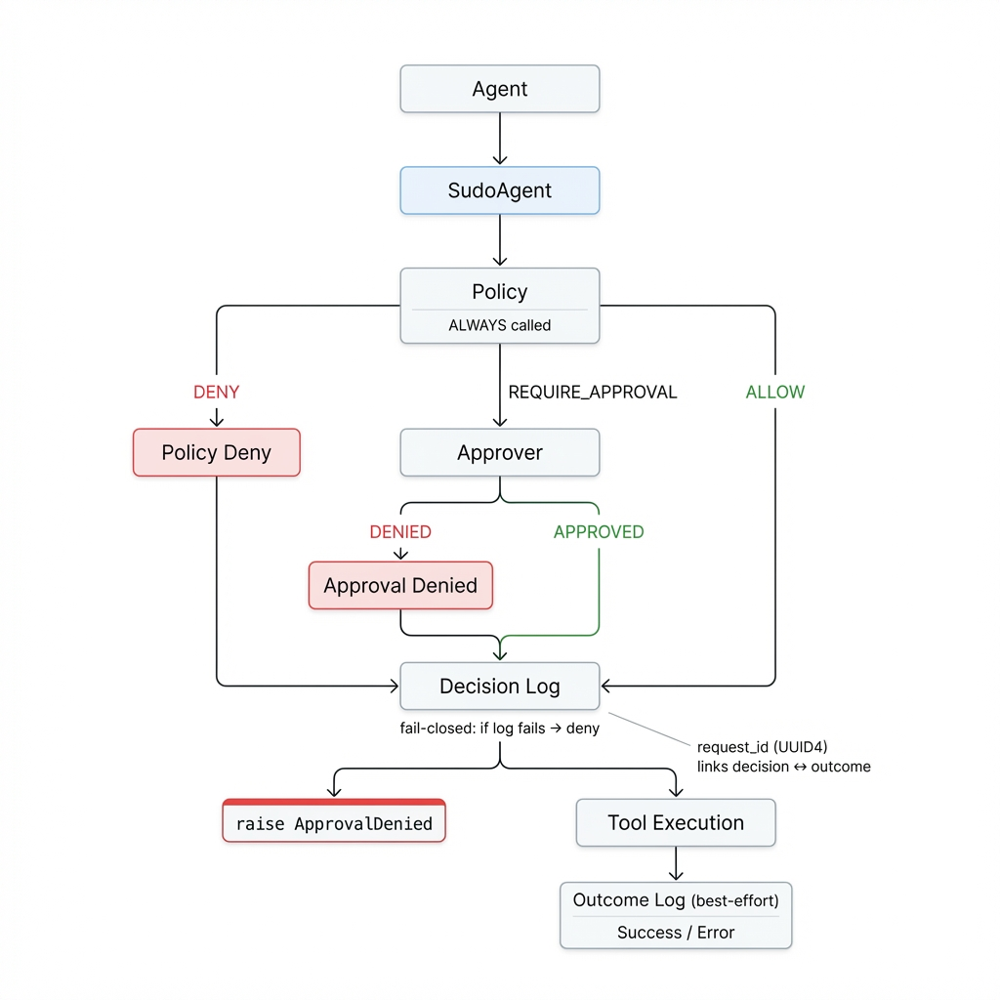

# Architecture

SudoAgent is a runtime guard for function calls. It evaluates a policy, optionally requests human approval, logs the decision, and then executes (or denies).

---

## Core invariant

**If anything fails before execution (policy, approval, or decision logging), the function does not execute.**

Decision logging is fail-closed. Outcome logging is best-effort.

---

## Components

### SudoEngine

Orchestrates policy evaluation, approval, and audit logging.

**Requires:** `policy` at construction. Pass `AllowAllPolicy()` explicitly for permissive mode.

**Responsibilities:**
- Build `Context` from function call
- Call `Policy.evaluate(ctx)` → returns `PolicyResult`
- If `REQUIRE_APPROVAL`, call `Approver.approve(ctx, result, request_id)`
- Write decision entry to audit log (fail-closed)
- Execute function (if allowed)
- Write outcome entry to audit log (best-effort)

**Not responsible for:**
- Interpreting business logic
- Handling exceptions beyond outcome logging (it re-raises the original)
- Redacting return values or side effects

### Context

A snapshot of a pending action:
- `action`: fully-qualified callable name (`module.qualname`)
- `args`: positional args tuple
- `kwargs`: keyword args dict
- `metadata`: user/system enrichment (trace_id, agent_id, etc.)

Policies treat `Context` as read-only.

### Policy

Returns a `PolicyResult`:
- `decision`: `ALLOW` / `DENY` / `REQUIRE_APPROVAL`
- `reason`: human-readable string for audit logs and approval UIs

Policies should be deterministic and side-effect-free.

### Approver

Invoked only when policy returns `REQUIRE_APPROVAL`.

- Returns `True` → approved, execution proceeds
- Returns `False` → denied, raises `ApprovalDenied`
- Raises exception → denied, raises `ApprovalError`

Default: `InteractiveApprover` (terminal y/n prompt).

### AuditLogger

Writes `AuditEntry` objects to a log.

Default: `JsonlAuditLogger` (append-only JSONL file).

Decision logging is **fail-closed**: if logging fails, execution is blocked and `AuditLogError` is raised.

---

## Execution flow

### Diagram

### Semantics table

| Path | Decision logged | Outcome logged | Result |
|------|-----------------|----------------|--------|
| Policy → `ALLOW` | `ALLOW` | Yes (best-effort) | Function executes |
| Policy → `DENY` | `DENY` | No | `raise ApprovalDenied` |
| Policy → `REQUIRE_APPROVAL` → approved | `ALLOW` (with `approved=True`) | Yes (best-effort) | Function executes |
| Policy → `REQUIRE_APPROVAL` → denied | `DENY` (with `approved=False`) | No | `raise ApprovalDenied` |
| Policy raises exception | `DENY` (with error) | No | `raise PolicyError` |
| Approver raises exception | `DENY` (with error) | No | `raise ApprovalError` |
| Decision logging fails | N/A | No | `raise AuditLogError` (blocks execution) |

**Note:** The `decision` field in the audit entry reflects the final enforcement decision (`ALLOW` or `DENY`), not the policy's original decision. The original policy decision is recorded in `metadata.policy_decision` for `REQUIRE_APPROVAL` paths.

---

## Audit log semantics

### Entry types

**Approved executions** produce **two entries**:
1. `event: "decision"` — logged before execution (fail-closed)
2. `event: "outcome"` — logged after execution (best-effort)

**Denied executions** produce **one entry**:
1. `event: "decision"` — logged before raising exception

### Correlation

All entries for the same call share a `request_id` (UUID4).

### Entry fields

Common fields:
- `timestamp` (UTC, timezone-aware)
- `request_id` (UUID4)
- `event` (`"decision"` or `"outcome"`)
- `action` (function name)
- `decision` (`"allow"` or `"deny"`)
- `reason` (human-readable)
- `metadata` (safe representations of args/kwargs)

Outcome-only fields:
- `outcome` (`"success"` or `"error"`)
- `error_type` (exception class name, if error)
- `error` (truncated message ≤200 chars, if error)

### Redaction

Args and kwargs are serialized with:
- `repr()` truncated to ~200 chars
- Sensitive key names redacted (`api_key`, `token`, `password`, etc.)
- Sensitive value patterns redacted (JWT-like, `sk-` prefix, PEM blocks)

### Ordering

- Decision logging: **before** execution, fail-closed
- Outcome logging: **after** execution, best-effort

### Concurrency

The default JSONL logger is intended for single-process use. Concurrent writes from multiple processes may interleave writes and produce mixed/garbled lines. For multi-process or multi-host deployments, implement a custom `AuditLogger`.

---

## Failure behavior

### Fail-closed guarantees

| Failure | Logged decision | Exception raised |
|---------|----------------|------------------|
| `Policy.evaluate` raises | `DENY` | `PolicyError` |
| `Approver.approve` raises | `DENY` | `ApprovalError` |
| `Approver.approve` interrupted (Ctrl+C/EOF) | `DENY` | `ApprovalError` |
| Decision logging fails | (none) | `AuditLogError` |

### Best-effort outcome logging

If outcome logging fails after a successful execution, the failure is silently ignored. The decision entry was already recorded.

---

## Security model

**Assumptions:**
- The guarded function is trusted code
- Inputs may be untrusted (agent/user controlled)

**Defends against:**
- Terminal markup injection (Rich output is escaped)
- Secret leakage in logs (redaction of common patterns)
- Unintended execution on errors (fail-closed)

**Does not defend against:**
- Malicious local user with filesystem access
- Sandbox escape or process isolation
- Side effects inside the guarded function

---

## Extending

Extension points:
- **Policy**: implement `evaluate(ctx) -> PolicyResult`
- **Approver**: implement `approve(ctx, result, request_id) -> bool`
- **AuditLogger**: implement `log(entry) -> None`

Extension method: dependency injection via `SudoEngine` constructor arguments.

Notes:
- Policy is required at construction
- `InteractiveApprover` is intended for local development
- `JsonlAuditLogger` is append-only by normal operation (not tamper-evident)

---

## Design decisions

**Why policy is required:** No default-allow footgun. Explicit policy prevents accidental permissive behavior.

**Why fail-closed on decision logging:** A safety layer that silently drops audit records is not safe.

**Why best-effort on outcome logging:** The decision is already recorded. Blocking the return value on a logging failure would be surprising.

**Why synchronous only (v0.1):** Async adds complexity. v0.1 focuses on correct, predictable semantics first.

**Why no built-in Slack/email approvers:** Integrations add operational dependencies. The approver interface supports external extensions.
